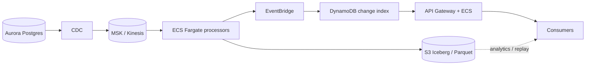

# Production AWS Architecture (Documentation Only)

**Exercise scope:** design how production addresses the same problem as the local prototype—incremental customer/case sync, durable lake, event propagation, companion change feeds—**without** lift-and-shifting `POST /ingest` onto ECS. The local service compresses read → stage → lake/share/events → checkpoint-last; at scale that becomes **CDC → stream → lake commits → events → indexed consumer API**, with **three separate offsets** (CDC, lake commit, consumer cursor). No AWS deployment or IaC in this repo.

---

## Diagram

---

## Data flow

| Stage | Path | Role |
|-------|------|------|
| **Durable storage** | Aurora WAL → CDC → MSK → processors → **Iceberg commits on S3** (Glue/Lake Formation) | Append/merge CDC; snapshot = publish boundary (≈ local checkpoint-last + `./lake/`) |
| **Eventing** | Processor → **EventBridge** → SQS → indexers | Batch-complete signal: tenant, table, `run_id`, snapshot, counts (≈ `./events/<run_id>.jsonl`) |
| **Consumer serving** | Indexer → **DynamoDB** → **API** (cursor + batch metadata) | Hot incremental poll/sync, p95 <300ms (≈ `./share/` + manifest, not raw lake scans) |

**Cold path:** Athena/Spark on Iceberg for analytics, reconciliation, backfill—not the 300 QPS incremental API.

---

## Service choices

| Component | Choice | Rationale |
|-----------|--------|-----------|
| Source | Aurora PostgreSQL | OLTP source of truth; multi-AZ |
| Ingest | DMS / logical replication → **MSK** | Ordered durable log; ~5k cases/s peak |
| Process | **ECS Fargate** micro-batches (1–5 min) | Sustained throughput; stateful commits vs Lambda-only |
| Lake | **S3 + Iceberg** (Parquet) | Open table standard; ACID snapshots; schema evolution |
| Govern | Glue + Lake Formation | Catalog; tenant isolation (~5k tenants) |
| Notify | EventBridge + SQS | Fan-out; retries; decouple commit from indexers |
| Serve | **DynamoDB** + API Gateway + ECS | Keyed incremental reads; 300–1k QPS |

---

## NFR coverage

| NFR | Target | Approach |
|-----|--------|----------|
| Scale | 5k tenants; 50M customers; 200M cases | Partition stream + lake by `tenant_id` / date; compaction |
| Throughput | Cases 5k/s peak, 1k/s sustained; customers 500/s peak | MSK partitions; autoscale Fargate on lag |
| Freshness | p95 ≤ 10 min to consumer-visible | Micro-batch + index update on Iceberg commit |
| Consumer API | 300 QPS, 1k burst; p95 <300ms, p99 <800ms | DynamoDB index + API—not Athena on hot path |
| Availability | 99.9% ingest + APIs | Multi-AZ Aurora, MSK, ECS |
| API recovery | RPO ≤5 min; RTO ≤30 min | Aurora PITR; MSK replay; blue/green API |
| Lake durability | ~zero loss | S3 versioning + Object Lock; Iceberg append-only files + snapshots |

---

## Failure handling

- **Before Iceberg commit:** do not advance MSK offset; redeliver batch.
- **After commit, before index:** retry via SQS; idempotent upsert on `run_id`.
- **Poison / schema break:** DLQ + schema registry gate.
- **AZ loss:** multi-AZ on Aurora, MSK, ECS.

Same principle as the prototype: **never advance “committed” past durable outputs**—here “committed” = Iceberg snapshot + index, not a single `checkpoint.json`.

---

## Replay & idempotency

| Offset | Stores |
|--------|--------|
| CDC / replication slot | WAL read position |
| Lake commit | Iceberg snapshot / processor state |
| Consumer cursor | Per-subscription position in DynamoDB |

**Replay:** rewind MSK or CDC → reprocess → **Iceberg MERGE** on `(tenant_id, table, pk, updated_at)` with deterministic `run_id` per batch. **Idempotency:** at-least-once CDC + merge dedupe + conditional DynamoDB writes; API uses cursor + batch version / `If-None-Match`.

---

## Lake immutability

Append-only Parquet files; new visibility via Iceberg **snapshots** (no in-place overwrites). S3 **versioning** + **Object Lock** on ingestion prefixes; lifecycle + scheduled **compaction**; snapshot expiry per retention tier.

---

## Top 3 cost drivers

1. **MSK (partitions × retention)** — right-size shards, compress, lag-based consumer scale, tiered retention.
2. **Aurora + CDC I/O** — replication on replica/DMS instance; archive cold tenants.
3. **S3 + Iceberg storage/compaction** — Intelligent-Tiering, target file size, prune old snapshots.

---

## Tradeoffs & assumptions

1. **At-least-once** CDC with idempotent merges—not exactly-once end-to-end.
2. **Minute-level batching** meets 10-min freshness; not sub-second streaming to consumers.
3. **Per-tenant ordering** only; cross-table atomic views are best-effort (consumers reconcile).
4. **Hot API** reads the change index; **Athena** is analytics/replay, not incremental QPS.
5. **Single region** v1; multi-region active-active deferred.
6. **Upsert-only** v1 (aligned with prototype); deletes need a later CDC path.
