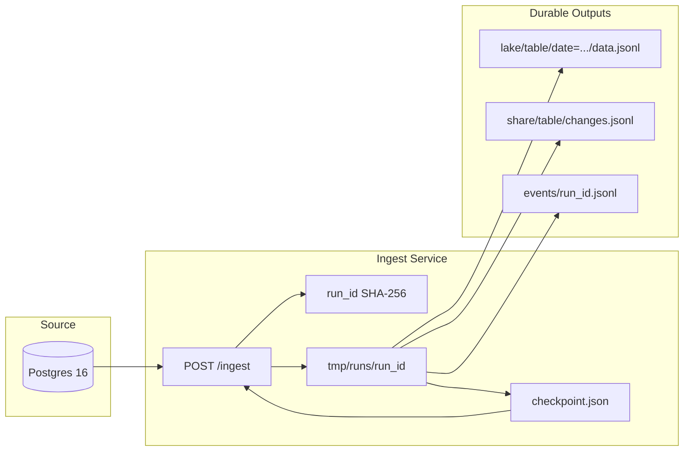
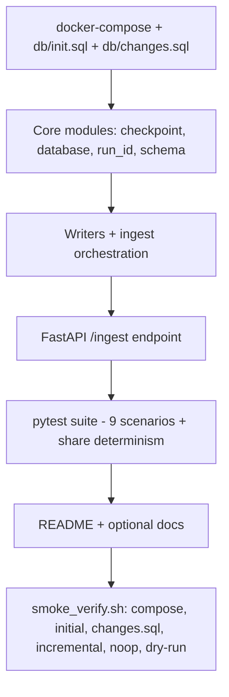

# Incremental Sync + Data Sharing — Development Plan

**Source of truth:** [`spec/planning-implementation-prompt.txt`](../spec/planning-implementation-prompt.txt)  
**Reference:** [`spec/incremental-sync-data-sharing.pdf`](../spec/incremental-sync-data-sharing.pdf) (requirements align with the TXT prompt; PDF is not machine-readable here, so TXT governs implementation)

**Status:** **Implemented** — local prototype complete; verified with **14 pytest tests** and **16 automated smoke checks** in [`scripts/smoke_verify.sh`](../scripts/smoke_verify.sh).

**Last reviewed:** 2026-05-17 (aligned to repo tree and `src/` behavior).

---

## Implementation todos

- [x] **foundation** — `docker-compose.yml`, `db/init.sql`, `db/changes.sql`, project skeleton, `.gitignore`
- [x] **core-modules** — `checkpoint.py`, `database.py`, `run_id.py`, `schema.py` (composite watermark queries)
- [x] **writers-ingest** — `writers.py`, `manifest.py`, `ingest.py` (staged `tmp/runs`, checkpoint-last; share/events via `os.replace`)
- [x] **api** — FastAPI `POST /ingest?dry_run`, recovery when `run_id` outputs already exist
- [x] **tests** — 9 spec scenarios + share determinism + schema fingerprint + failure depth; 14 tests passing
- [x] **docs** — `README.md`, `AI_USAGE.md`, `ARCHITECTURE_AWS.md`, `EXECUTION_PLAN.md`
- [x] **smoke-verify** — Automated: `./scripts/smoke_verify.sh` (compose, initial → `changes.sql` → incremental → noop → dry-run)

---

## 1. What we are building

A local prototype service that:

1. Incrementally reads changed rows from Postgres (`customers`, `cases`)
2. Appends CDC-style rows to date-partitioned lake JSONL files
3. Produces per-table consumer share artifacts (`./share/{table}/changes.jsonl`)
4. Writes durable per-run event files (`./events/<run_id>.jsonl`)
5. Maintains a composite per-table checkpoint at `./state/checkpoint.json` (`updated_at` + `last_pk`)
6. Exposes `POST /ingest?dry_run=true|false` with full manifest and staged, checkpoint-last crash safety



---

## 2. Technology choices

| Area | Choice | Rationale |
|------|--------|-----------|
| Language | Python **3.11+** recommended; **3.9+** minimum (README; `.venv` may be 3.9) | Spec preference vs local venv |
| HTTP | FastAPI + uvicorn | Spec preference; run via `.venv/bin/python -m uvicorn` |
| DB driver | **`psycopg` 3** (sync) | Implemented in `database.py`; no async driver |
| Tests | pytest + FastAPI `TestClient` | Integration-style against Docker Postgres |
| Config | `src/config.py`: `DATABASE_URL` + `Paths` (`state/`, `lake/`, `share/`, `events/`, `tmp/`) | Spec contract; tests monkeypatch `get_paths()` |

No AWS, Kafka, Airflow, or Debezium in the implementation (optional docs only).

---

## 3. Repository layout

```
docker-compose.yml
db/init.sql
db/changes.sql
README.md
requirements.txt
scripts/smoke_verify.sh     # 16-check E2E smoke (INF/ING/CHG)
planning/development-plan.md
AI_USAGE.md
ARCHITECTURE_AWS.md
EXECUTION_PLAN.md
src/
  config.py               # DATABASE_URL, Paths, PROJECT_ROOT
  main.py                 # FastAPI: GET /health, POST /ingest
  ingest.py               # orchestration pipeline + recovery
  database.py             # psycopg connect + incremental queries
  checkpoint.py           # load/save, Watermark, PK_FIELDS
  run_id.py               # canonical JSON + SHA-256
  schema.py               # schema fingerprint (information_schema)
  writers.py              # stage/promote lake, share, events
  manifest.py             # manifest assembly
tests/
  conftest.py             # fresh_db (compose reset), workspace tmp_path
  test_initial_ingest.py
  test_incremental.py
  test_noop.py
  test_dry_run.py
  test_watermark_ties.py
  test_run_id.py
  test_artifacts.py       # share + event structure (3 tests)
  test_failure_safety.py
  test_share_determinism.py
  test_schema_fingerprint.py
state/   lake/   share/   events/   tmp/   # runtime; .gitignore
```

---

## 4. Database layer

### 4.1 Docker Compose (`docker-compose.yml`)

Exact contract:

- Image: `postgres:16`
- Port: `5432`
- `POSTGRES_DB=interop`, `POSTGRES_USER=interop`, `POSTGRES_PASSWORD=interop`
- Mount `db/init.sql` into `/docker-entrypoint-initdb.d/`

### 4.2 Schema (`db/init.sql`)

Exact tables, columns, types, and indexes per spec (lines 75–96 of prompt).

### 4.3 Seed data (`db/init.sql`)

- Fixed anchor timestamp literal (e.g. `TIMESTAMPTZ '2026-03-01T00:00:00Z'`)
- Derive all `updated_at` via `anchor + interval` — no randomness
- **32 customers**, **210 cases** (meets spec minimums ≥30 / ≥200)
- `updated_at` spans 30-day window (anchor + day/hour offsets)
- Case titles/descriptions include keywords: billing, audit, compliance, payments, reconciliation, onboarding, fraud, AML

### 4.4 Change script (`db/changes.sql`)

Fixed timestamp **later than** all seed timestamps:

- Update exactly 5 existing cases (status + `updated_at`)
- Insert exactly 2 new customers
- Insert exactly 10 new cases (mix of existing + new customers)

**Post-change expected deltas:** customers `2`, cases `15` (2 new customers + 5 updates + 10 inserts).

---

## 5. Core ingestion logic

### 5.1 Composite watermark query (`src/database.py`)

Per table with PK from `PK_FIELDS`: `customer_id` (customers), `case_id` (cases):

```sql
SELECT <columns> FROM <table>
WHERE updated_at > :wm_at
   OR (updated_at = :wm_at AND <pk> > :wm_pk)
ORDER BY updated_at ASC, <pk> ASC
```

- **Initial run** (missing checkpoint / null watermark): full table scan with same `ORDER BY`
- **Assumption (README):** source data is stable for the duration of a single `/ingest` request

### 5.2 Checkpoint (`src/checkpoint.py`)

- Path: `./state/checkpoint.json`
- Shape: per-table `{ "updated_at": ISO-8601 Z, "last_pk": int }`
- `checkpoint_after` = watermark of **last processed row** in deterministic order; if zero rows for a table, copy `checkpoint_before` for that table
- Atomic write: `checkpoint.json.tmp` → flush → `os.replace` → `checkpoint.json`
- **Never advance checkpoint before durable outputs are committed**

### 5.3 Deterministic `run_id` (`src/run_id.py`)

1. Build canonical JSON: `{ "checkpoint_before": ..., "tables": { "cases": [...], "customers": [...] } }` (tables sorted in payload)
2. Each identity: `{ "table", "primary_key", "updated_at" }` in query order (`run_id.py`)
3. `json.dumps(..., sort_keys=True, separators=(",", ":"))`
4. `run_id = sha256(hex digest)` — no UUIDs, no wall-clock

### 5.4 Schema fingerprint (`src/schema.py`)

**Implemented:** query `information_schema.columns` for `(column_name, data_type)` ordered by `ordinal_position`, canonical JSON + SHA-256.

---

## 6. `/ingest` pipeline (`src/ingest.py`)

Shared steps for **both** dry-run and non-dry-run:

1. `started_at` (UTC ISO-8601; used only in manifest, not in `run_id`)
2. Load `checkpoint_before` (or `null` per table if missing)
3. Fetch deltas for `customers` and `cases`
4. Compute `checkpoint_after` per table
5. Compute `run_id`
6. Build manifest (paths predicted even for dry-run)

### 6.1 Dry run (`dry_run=true`)

- Return manifest with `checkpoint_before`, predicted `checkpoint_after`, `lake_paths`, `share_path`, `schema_fingerprint`
- **Write nothing** — no lake, share, events, checkpoint changes

### 6.2 Non-dry run (`dry_run=false`)

**Staged commit** under `./tmp/runs/<run_id>/`:

| Step | Action |
|------|--------|
| 1 | If recovery applies (see §6.3), skip rewrites and only advance checkpoint |
| 2 | Group delta rows by UTC date → stage lake JSONL per `lake/{table}/date=YYYY-MM-DD/data.jsonl` |
| 3 | If `delta_row_count > 0`, stage `share/{table}/changes.jsonl` (full batch, ordered, `op: upsert`) |
| 4 | Stage `events/{run_id}.jsonl` — **two lines** (customers + cases); zero-delta table: `delta_row_count=0`, `share_path=null` |
| 5 | Validate staged JSONL (parse each line) |
| 6 | **Promote:** lake partitions **append** to existing `data.jsonl`; share and event files via **`replace_file_atomic`** (`os.replace` on temp file) |
| 7 | Print event lines to stdout (best-effort, not crash boundary) |
| 8 | **Last:** atomic checkpoint write (`checkpoint.json.tmp` → `os.replace`) |

On failure before step 8: leave checkpoint unchanged; clean up `tmp/runs/<run_id>/`.

**No-op run (`delta_row_count=0`):** still writes `./events/<run_id>.jsonl` (two lines with zero-delta fields); does **not** append lake or replace share. Repeated no-op with the same `run_id` may hit recovery (see §6.3).

### 6.3 Checkpoint-failure recovery (`outputs_materialized`)

If `outputs_materialized()` is true for the recomputed `run_id` and manifest paths:

- `./events/<run_id>.jsonl` exists, and
- every `lake_paths` / non-null `share_path` entry in the manifest exists on disk

Then treat outputs as already materialized: **skip** lake/share/event rewrites and only run step 8 (checkpoint write). Used after a crash between promotion and checkpoint, and for idempotent re-runs when artifacts already match.

Documented in README; `test_share_determinism.py::test_share_artifact_unchanged_on_recovery` and failure-safety tests cover related behavior.

### 6.4 Lake writer

- Append-only JSONL per partition; one JSON object per line (row payload)
- Multiple dates in one run → multiple `lake_paths`
- No-op run (`delta_row_count=0`) → no lake writes, `lake_paths=[]`

### 6.5 Share writer

Each line includes: `table`, `op`, `customer_id` or `case_id`, `updated_at`, `run_id`, `schema_fingerprint`, `checkpoint_after`, `record` (`op` is always `upsert`)

- Replace `./share/{table}/changes.jsonl` per successful batch with deltas
- Zero-delta: do **not** touch existing share file; manifest `share_path=null`

### 6.6 Manifest (`src/manifest.py`)

Required fields per spec: `run_id`, `started_at`, `finished_at`, `dry_run`, `checkpoint_before`, `checkpoint_after`, per-table `delta_row_count`, `lake_paths`, `share_path`, `schema_fingerprint`.

---

## 7. HTTP service (`src/main.py`)

- `POST /ingest?dry_run: bool = False`
- Return manifest JSON; HTTP 500 on unrecoverable failure
- Optional health route for tests: `GET /health`

---

## 8. Test plan (pytest)

- **HTTP:** FastAPI `TestClient` (`conftest.client`)
- **Outputs:** `workspace` fixture → `tmp_path` via `get_paths(tmp_path)` monkeypatch
- **Database:** `fresh_db` runs `docker compose down -v` / `up -d` per test (not testcontainers); skips suite if Postgres is down

| # | Scenario | Test module | Key assertions |
|---|----------|-------------|----------------|
| 1 | Initial ingest | `test_initial_ingest.py` | ≥30 / ≥200 deltas; checkpoint; lake/share/event exist |
| 2 | After `changes.sql` | `test_incremental.py` | `delta_row_count`: customers=2, cases=15 |
| 3 | No-op third ingest | `test_noop.py` | Zero deltas; `lake_paths=[]`, `share_path=null`; lake/share checksums unchanged (events may get a new file) |
| 4 | Dry run | `test_dry_run.py` | Predicted `checkpoint_after`; no checkpoint or lake/share writes |
| 5 | Timestamp ties | `test_watermark_ties.py` | Composite watermark does not skip PKs at same `updated_at` |
| 6 | Deterministic `run_id` | `test_run_id.py` | Same DB + checkpoint → identical 64-char hex `run_id` |
| 7 | Share structure | `test_artifacts.py` | Required fields on every share JSONL line |
| 8 | Event structure | `test_artifacts.py` | `events/<run_id>.jsonl` has 2 lines; zero-delta event on noop |
| 9 | Failure safety | `test_failure_safety.py` | Checkpoint unchanged; lake/share/events materialized before failure |
| 10 | Share determinism | `test_share_determinism.py` | Byte-identical share rewrite; recovery does not duplicate lake/share |

| 11 | Schema fingerprint | `test_schema_fingerprint.py` | Matches `information_schema`; stable across calls |

**14 tests** collected. Run: `.venv/bin/python -m pytest -v` (requires Docker Postgres on port 5432).

---

## 9. Documentation deliverables

### Required: `README.md`

Sections per spec: Overview, Deliverables, DB contract, Running locally, `/ingest`, checkpointing, dry-run, outputs, manifest, crash consistency, replay/idempotency, schema evolution, testing, assumptions.

Include commands:

```bash
docker compose up -d
.venv/bin/python -m uvicorn src.main:app --reload --host 0.0.0.0 --port 8000
curl -X POST "http://localhost:8000/ingest?dry_run=false"
curl -X POST "http://localhost:8000/ingest?dry_run=true"
docker exec -i $(docker compose ps -q postgres) psql -U interop -d interop < db/changes.sql
.venv/bin/python -m pytest -v
./scripts/smoke_verify.sh
```

### Optional (post-core) — delivered

- [`AI_USAGE.md`](../AI_USAGE.md) — tools, prompts, manual verification, guardrails
- [`ARCHITECTURE_AWS.md`](../ARCHITECTURE_AWS.md) — production CDC → lake → consumer API (documentation only)
- [`EXECUTION_PLAN.md`](../EXECUTION_PLAN.md) — 4 × 2-week sprints (~9–10 weeks to canary); **baseline** 2 FTE + tech lead (~18–20 pw); **AI-assisted** 1 FTE + tech lead + 0.5 SRE (~16–18 pw)

---

## 10. Implementation sequence — complete



**Phases (done):**

1. **Foundation** — Compose, SQL scripts, project skeleton, `.gitignore` for runtime dirs
2. **Core engine** — Queries, checkpoint, run_id, staged writers, manifest
3. **API + recovery** — FastAPI route, idempotent recovery path
4. **Tests** — All required categories + share byte-identical test
5. **Docs + polish** — README, AWS/execution/AI docs, automated smoke script

---

## 11. Acceptance checklist (from spec)

All **16 acceptance criteria** in the prompt (lines 1019–1036) are exercised by pytest and/or smoke script, including:

- Composite checkpoint (`updated_at` + `last_pk`)
- Checkpoint written **last**
- Dry-run writes nothing
- Deterministic `run_id` and share artifact byte identity
- No-op runs produce no lake/share duplicates

**Smoke script checks (16):** `INF-01`–`03` (venv, Postgres, `/health`); `ING-01`–`11` (initial, incremental, noop, dry-run + checkpoint unchanged); `CHG-01`–`02` (container, `changes.sql`).

**Known gaps (optional, not blocking):**

- Python 3.11: recommended in README; local `.venv` may still be 3.9.x

---

## 12. Explicit non-goals

- Multi-file filesystem transactions
- Cross-table transactional consistency beyond “stable DB during ingest”
- Cloud infrastructure implementation
- DELETE operations in share artifacts (`op` is `upsert` only)

---

**Implementation complete.** For local verification: `docker compose up -d`, `.venv/bin/python -m pytest -v`, `./scripts/smoke_verify.sh`.
